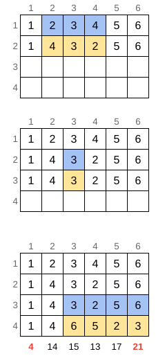

Enunciado

Matriz de Codibentinho

Codibentinho está aprendendo matrizes e alocação dinâmica no curso de programação e elaborou um exercício para testar seus conhecimentos.

O exercício é assim: primeiro, Codibentinho cria uma matriz de tamanho N×M
e preenche a primeira linha com a sequência 1,2,3,…,M.

Em seguida, Codibentinho sorteia dois números x1
e x2 com valores entre 1 e M. Ele usa esses números para fazer uma operação de inversão da seguinte forma: ele copia todos os números da primeira linha da matriz para a segunda, mas inverte aqueles que estão entre as posições x1 e x2.

Codibentinho repete esse procedimento N−1 vezes, sempre sorteando e invertendo, até preencher a matriz inteira.
Ao final, ele soma os valores das colunas e verifica qual coluna tem a menor e a maior somas.

Entrada

A primeira linha da entrada tem os valores N e M, indicando o número de linhas e de colunas da matriz, respectivamente. Esses números podem ser bem grandes, portanto você deve usar alocação dinâmica.

Em seguida, aparecem N−1 pares de valores x1 e x2, indicando as inversões realizadas por Codibentinho. Note que os valores são apresentados na ordem em que eles foram sorteados.

Saída

Imprima a menor e a maior somas dos valores das colunas da matriz resultante.

Exemplo ilustrado

O primeiro exemplo de caso de teste está ilustrado na figura a seguir. Cada tabela indica um passo da resolução do caso de teste. Como a matriz tem quatro linhas, Codibentinho fez três inversões, indicadas pelas cores. Na última tabela observamos a matriz final. Os números abaixo dessa matriz contêm as somas dos elementos das colunas.

Exemplos de Entrada e Saída
Entrada 	

4 6

---
2 4

3 3

6 3

Saída 	

4 21

Entrada 	

13 30

25 26

4 11

25 27

24 24

1 30

25 13

5 25

16 14

1 15

2 25

26 8

30 15

Saída 	

130 288

Entrada 	

34 100000

68902 48629
24286 97402
21057 40582
85812 6116
100000 1
17501 67449
25426 84707
80975 71816
28774 8382
42207 77781
37225 51461
62777 57112
59680 84960
17457 73108
73108 100000
53088 8505
64203 27495
92475 54175
51576 33105
90038 33113
39228 72633
56433 75849
60555 56728
44895 81858
6592 57881
35661 73669
1 35661
25129 48798
5909 72885
74197 4258
77365 81940
6796 91653
100000 81940

Saída 	

652937 2659845
