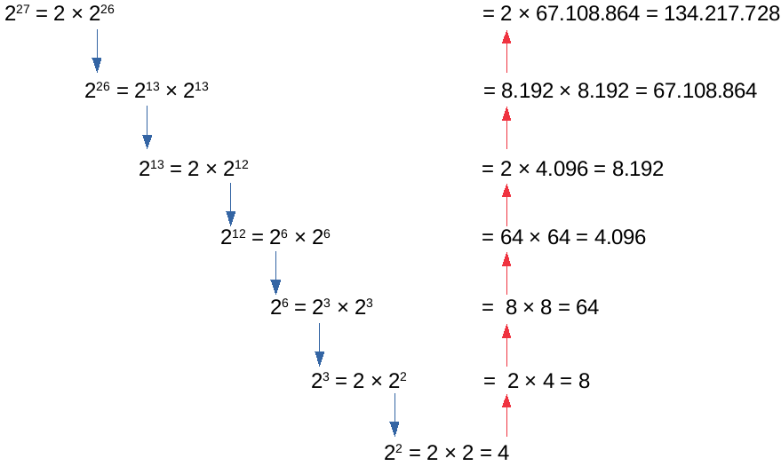

<h1>Potenciação eficiente<h1>

<h2>A forma simples e ingênua de calcular uma potência com expoente inteiro é fazer multiplicações repetidas, como em 34=3×3×3×3. Infelizmente, essa abordagem tem um custo computacional elevado. Por exemplo, se quisermos encontrar 28, precisamos realizar 7 multiplicações. Talvez isso não pareça muito, mas esse mesmo resultado poderia ser encontrado com menos passos se observássemos que 28=24×24. A potência 24=16 é facilmente calculada "de cabeça", então o resultado que procurávamos poderia ser obtido com a conta 28=16×16.<h2>
 

<h2>De modo geral, se tivermos um expoente par, então x2n=xn×xn
e, se tivermos um expoente ímpar, xn=x×xn−1. Essa relação permite reduzir até pela metade o número de multiplicações para encontrar qualquer potência. Para ilustrar, veja a figura abaixo, que mostra como só precisamos fazer 7 multiplicações para encontrar 2^27.<h2>
 

 
<h2>Neste exercício você deverá elaborar uma função recursiva f(b,e)
que usa a seguinte relação de recorrência para encontrar a potência be:
 
be={b×be−1, se e é ímpar(be2)2, se e é par
 
Observe que, para o algoritmo ser eficiente, você só deve efetuar a chamada recursiva uma vez em cada passo. As setas azuis na figura indicam as chamadas recursivas. Note que em nenhum caso existem duas setas azuis no mesmo "nível". Por exemplo, para calcular 226
foi realizada apenas uma chamada recursiva para 213.<h2>
 
<h2>Entrada e Saída<h2>

<h2>A entrada consistirá de vários pares de inteiros contendo os valores de base e expoente. Todos os valores serão não negativos.<h2>

<h2>O fim da entrada é indicado pelo fim do fluxo. Ou seja, você deve ler até a função scanf retornar EOF.<h2>
 
Exemplos de Entrada e Saída
 
<h2>Entrada 

2 8

2 13

10 8

3 19

4 15

18 7

Saída 
	
256

8192

100000000

1162261467

1073741824

612220032
<h2>